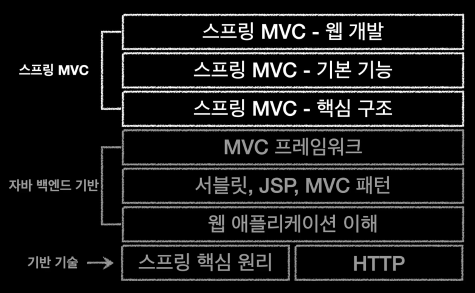

# 소개

## 강의 소개

* 20년전으로 돌아가 자바 웹 기술의 시작부터 최신 실무 기술까지
  * 어떤 기술이 불편해서 개선되었는지 확인
* MVC 프레임워크를 직접 코드로 개발
  * 단계적으로 발전해나가며 Spring MVC의 내부를 깊이있게 이해

## 정리
* 백엔드 개발자를 위한 모든 웹 기술 기초부터 완성까지
* 스프링 MVC 핵심 원리와 구조 이해