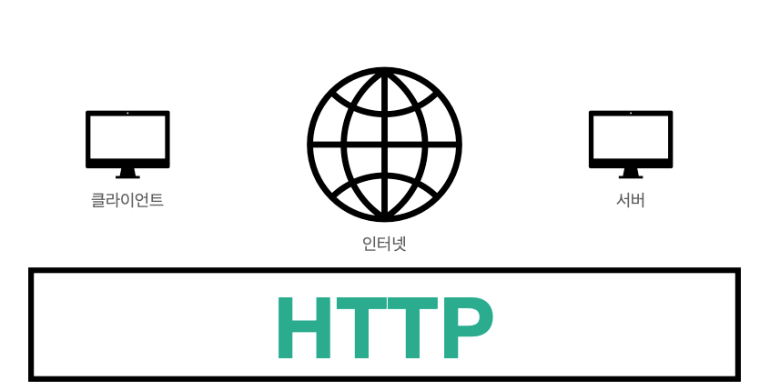
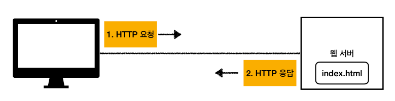
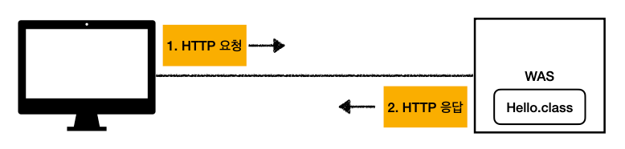
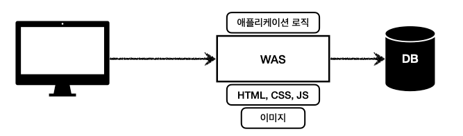
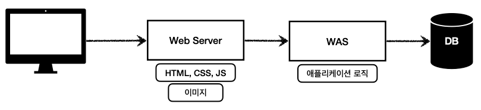
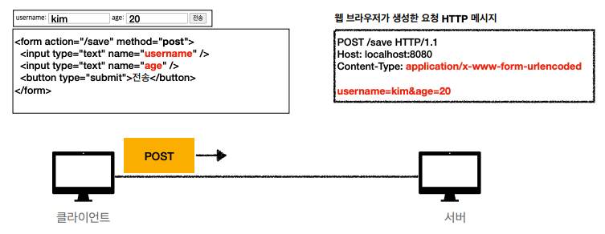
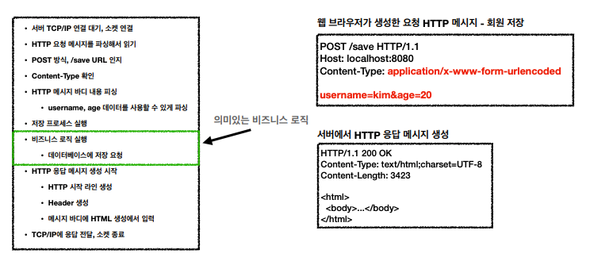
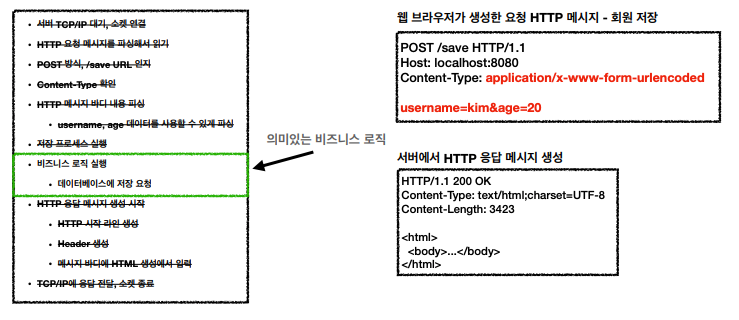
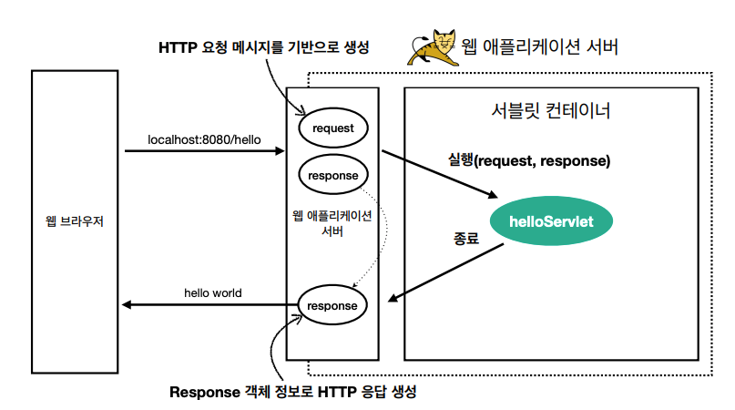
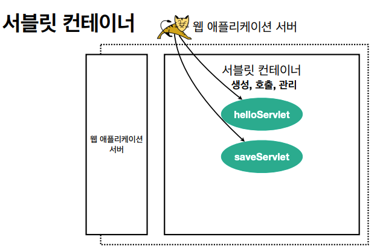

# 웹 애플리케이션 이해

## 웹 서버, 웹 애플리케이션 서버

### 모든 것이 HTTP
> HTTP 메시지에 모든 것을 전송
* HTML, TEXT
* 이미지, 음성, 영상, 파일
* JSON, XML (API)
* 거의 모든 형태의 데이터 전송 가능
* 서버간에 데이터를 주고 받을 때도 대부분 HTTP 사용

### 웹 서버 ( Web Server )

* HTTP 기반으로 동작
* **정적 리소드 제공**, 기타 부가기능
* 정적(파일) HTML, CSS, JS, 이미지, 영상
* NGINX, APACHE

### 웹 애플리케이션 서버 ( Web Application Server )

* HTTP 기반으로 동작
* 웹 서버 기능 포함
* 프로그램 코드를 실행해서 **애플리케이션 로직 수행**
  * 동적 HTML, HTTP API (JSON)
  * 서블릿, JSP, 스프링 MVC
* Tomcat, Jetty, Undertow

### 웹 시스템 구성 - WAS, DB

* WAS와 DB만으로 시스템 구성 가능
* WAS는 정적 리소스, 애플리케이션 로직 모두 제공 가능
* WAS가 너무 많은 역할을 담당, 서버 과부화 우려
* 가장 비싼 애플리케이션 로직이 정적 리소스 때문에 수행이 어려울 수 있음
* WAS 장애시 오류 화면도 노출 불가능

### 웹 시스템 구성 - WEB, WAS, DB

* 정적 리소스는 WS가 처리
* WS는 애플리케이션 로직같은 동적인 처리가 필요하면 WAS에 요청을 위임
* WAS는 중요한 애플리케이션 로직 전담
* 효율적인 리소스 관리
  * 정적인 리소스가 많이 사용되면 WS 증설
  * 애플리케이션 리소스가 많이 사용되면 WAS 증설
* 정적 리소스만 제공하는 WS는 잘 죽지 않음
* 애플리케이션 로직이 동작하는 WAS는 잘 죽음
* WAS, DB 장애시 WS가 오류 화면 제공 가능

## 서블릿
### HTML Form 데이터 전송


### 서버에서 처리해야 하는 업무
* 웹 애플리케이션 서버 직접 구현

  * 비즈니스 로직의 구현에 필요한 데이터를 직접 찾아야 한다.
* 서블릿을 지원하는 WAS 사용

  * 비즈니스 로직의 구현에 필요한 데이터를 서블릿이 찾아준다.

### 서블릿 특징
```java
@WebServlet(name = "helloServlet", urlPatterns = "/hello")
public class HelloServlet extends HttpServlet {
  @Override
  protected void service(HttpServletRequest request, HttpServletResponse response) {
    /* 애플리케이션 로직 */
  }
}
```
* `urlPatterns(/hello)`의 URL이 호출되면 서블릿 코드가 실행
* HTTP 요청 정보를 편리하게 사용할 수 있는 `HttpServletRequest`
* HTTP 응답 정보를 편리하게 사용할 수 있는 `HttpServletResponse`
* 개발자는 HTTP 스펙을 매우 편리하게 사용

### HTTP 요청, 응답 흐름

* WAS는 Request, Response 객체를 새로 만들어서 서블릿 객체 호출
* 개발자는 Request 객체에서 HTTP 요청 정보를 편리하게 꺼내서 사용
* 개발자는 Response 객체에서 HTTP 응답 정보를 편리하게 입력
* WAS는 Response 객체에 담겨 있는 내용으로 HTTP 응답 정보를 생성

### 서블릿 컨테이너

* 톰캣처럼 **서블릿을 지원하는 WAS**를 서블릿 컨테이너라고 함
* 서블릿 컨테이너는 서블릿 객체를 **생성, 초기화, 호출, 종료하는 생명주기 관리**
* 서블릿 객체는 **싱글톤으로 관리**
  * 고객의 요청이 올 때 마다 계속 객체를 생성하는 것은 비효율적
  * 최초 로딩 시점에 서블릿 객체를 미리 만들어두고 재활용
  * 모든 고객 요청은 동일한 서블릿 객체 인스턴스에 접근
  * **공유 변수 사용 주의**
  * 서블릿 컨테이너 종료시 함께 종료
* JSP도 서블릿으로 변환되어서 사용
* 동시 요청을 위한 멀티 쓰레드 처리 지원

## 동시 요청 - 멀티 쓰레드

## HTML, HTTP API, CSR, SSR

## 자바 백엔드 웹 기술 역사
