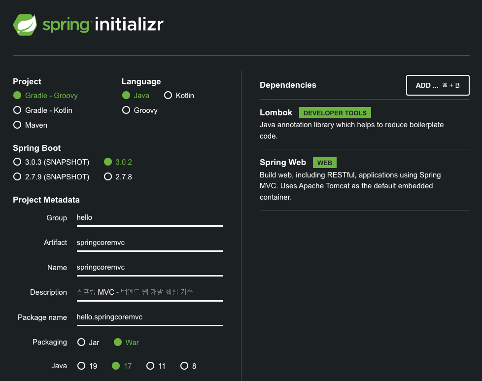
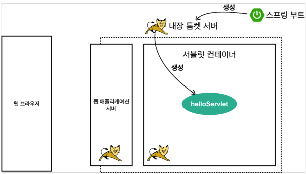
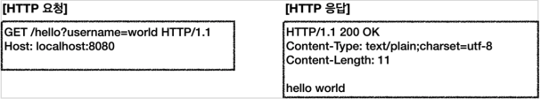
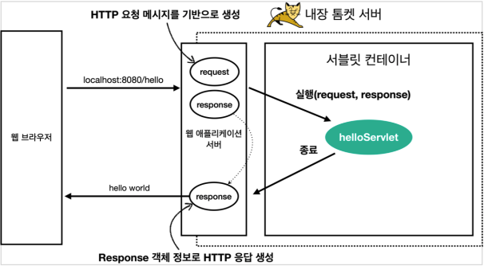
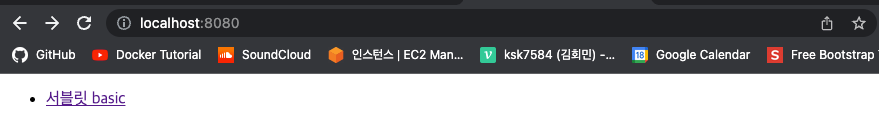
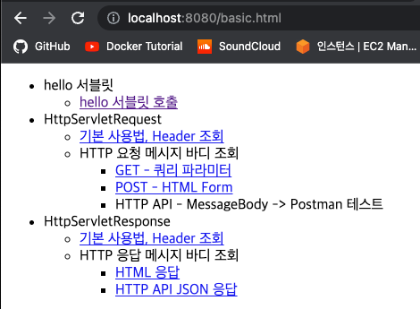
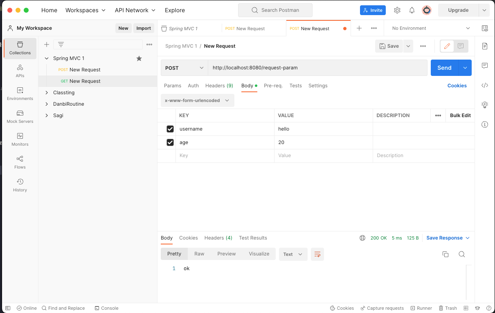
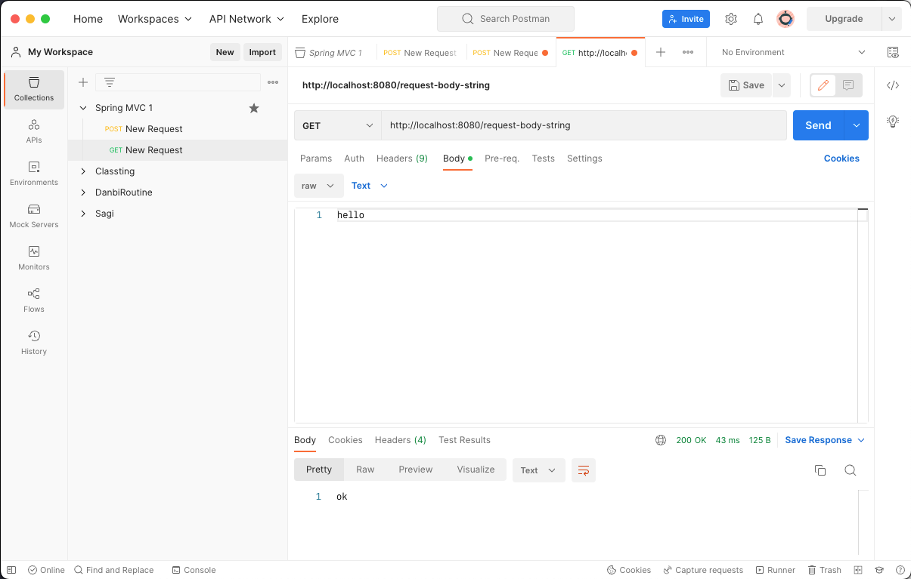
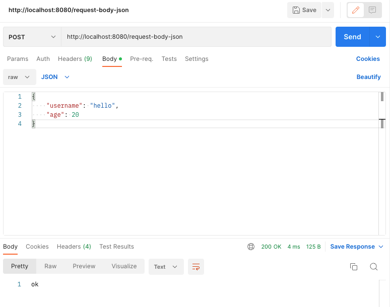
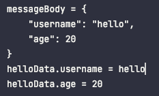

# 서블릿
## 프로젝트 생성

* https://start.spring.io/
* Packaging은 Jar가 아닌 War로 선택해 주어야 한다.
  * 이는 JSP를 실행하기 위해서이다.

## Hello Servlet
스프링 부트 환경에서 서블릿 등록하고 사용해보자.
> 참고<br>
> 서블릿은 톰캣 같은 웹 애플리케이션 서버를 직접 설치하고, 
> 그 위에 서블릿 코드를 클래스 파일로 빌드해서 올린 다음, 톰캣 서버를 실행하면 된다. 하지만 이 과정은 너무 번거롭다.<br>
> 스프링 부트는 톰캣 서버를 내장하고 있으므로, 톰캣 서버 설치 없이 편리하게 서블릿 코드를 실행할 수 있다.

### 스프링 부트 서블릿 환경 구성
스프링 부트는 서블릿을 직접 등록해서 사용할 수 있도록, `@ServletComponentScan`을 지원한다. 다음과 같이 추가하자. 

`hello.springcoremvc.ServletApplication`
```java
@ServletComponentScan // 서블릿 자동 등록
@SpringBootApplication
public class ServletApplication {
    public static void main(String[] args) {
        SpringApplication.run(ServletApplication.class, args);
    }
}
```

### 서블릿 등록하기
처음으로 실제로 동작하는 서블릿 코드를 등록해보자.

`hello.springcoremvc.ServletApplication`
```java
@WebServlet(name = "helloServlet", urlPatterns = "/hello")
public class HelloServlet extends HttpServlet {
  @Override
  protected void service(
          HttpServletRequest req, HttpServletResponse resp
  ) {
    System.out.println("HelloServlet.service");
    System.out.println("req = " + req);
    System.out.println("resp = " + resp);

    // 파라미터 획득
    String userName = req.getParameter("username");
    System.out.println("userName = " + userName);

    // Response Header 설정
    resp.setContentType("txt/plain");
    resp.setCharacterEncoding("utf-8");

    // Response
    resp.getWriter().write("hello " + userName);
  }
}
```
* `@WebServlet` 서블릿 애노테이션
  * name: 서블릿 이름
  * urlPatterns: URL 매핑
  * HTTP 요청을 통해 매핑된 URL이 호출되면 서블릿 컨테이너는 다음 메서드를 실행한다.
    * `protected void service(HttpServletRequest req, HttpServletResponse resp)`
* 웹 브라우저 실행
  * http://localhost:8080/hello?username=world
  * 결과: Hello world
* 콘솔 실행 결과
```
HelloServlet.service
req = org.apache.catalina.connector.RequestFacade@447f0797
resp = org.apache.catalina.connector.ResponseFacade@3d5e59f1
userName = world
```

### HTTP 요청 메시지 로그로 확인하기
`application.properties`
```properties
logging.level.org.apache.coyote.http11=debug
```
> **참고**<br>
> 운영서버에 이렇게 모든 요청 정보를 다 남기면 성능저하가 발생할 수 있다.
> 개발 단계에서만 사용하자.

### 서블릿 컨테이너 동작 방식 설명
**내장 톰캣 서버 생성**


**HTTP 요청, HTTP 응답 메시지**


**웹 애플리케이션 서버의 요청 응답 구조**


> 참고<br>
> HTTP 응답에서 Content-Length는 웹 애플리케이션 서버가 자동으로 생성해준다.

### Welcome 페이지 추가



## HttpServletRequest - 개요
### HttpServletRequest의 역할
HTTP 요청 메시지를 개발자가 직접 파싱해서 사용해도 되지만, 매우 불편할 것이다.
서블릿은 개발자가 HTTP 요청 메시지를 편리하게 사용할 수 있도록 개발자 대신에 HTTP 요청 메시지를 파싱한다.
그리고 그 결과를 `HttpServletRequest` 객체에 담아서 제공한다.

**HTTP 요청 메시지**
```
POST /save HTTP/1.1
Host: localhost:8080
Content-Type: application/x-www-form-urlencoded

username=kim&age=20
```
* START LINE
  * HTTP Method
  * URL
  * Query String
  * Schema, Protocol
* HEADER
  * 헤더 조회
* BODY
  * form 파라미터 형식 조회
  * message body 데이터 직접 조회

### 여러가지 부가 기능
* 임시 저장소 기능
  * 해당 HTTP 요청이 시작부터 끝날 때까지 유지되는 임시 저장소 기능
    * 저장: `req.setAttribute(key, value);`
    * 조회: `req.getAttribute(key);`
* 세션 관리 기능
  * `req.getSession(create: true);`

> **중요**<br>
> HttpServletRequest, HttpServletResponse를 사용할 때 가장 중요한 점은 
> 이 객체들이 HTTP 메시지, HTTP 응답 메시지를 **편리하게 사용하도록 도와주는 객체**라는 점이다.
> 따라서 이 기능에 대해서 깊이있는 이해를 하려면 **HTTP 스펙이 제공하는 요청, 응답 메시지 자체를 이해**해야 한다.

## HttpServletRequest - 기본 사용법
`hello.springcoremvc.basic.request.RequestHeaderServlet`
```java
@WebServlet(
        name = "requestHeaderServlet",
        urlPatterns = "/request-header"
)
public class RequestHeaderServlet extends HttpServlet {
    @Override
    protected void service(
            HttpServletRequest req,
            HttpServletResponse resp
    ) throws IOException {
        printStartLine(req);
        printHeaders(req);
        printHeaderUtils(req);
        printEtc(req);

        resp.getWriter().write("ok");
    }
}
```

### Start Line 정보
```java
public class RequestHeaderServlet extends HttpServlet {
  private void printStartLine(HttpServletRequest req) {
    System.out.println("--- REQUEST LINE -- START ---");

    System.out.println("req.getMethod() = " + req.getMethod());
    System.out.println("req.getProtocol() = " + req.getProtocol());
    System.out.println("req.getScheme() = " + req.getScheme());
    System.out.println("req.getRequestURL() = " + req.getRequestURL());
    System.out.println("req.getRequestURI() = " + req.getRequestURI());
    System.out.println("req.getQueryString() = " + req.getQueryString());
    System.out.println("req.isSecure() = " + req.isSecure());

    System.out.println("--- REQUEST LINE -- END ---");
  }
}
```
```
--- REQUEST LINE -- START ---
req.getMethod() = GET
req.getProtocol() = HTTP/1.1
req.getScheme() = http
req.getRequestURL() = http://localhost:8080/request-header
req.getRequestURI() = /request-header
req.getQueryString() = null
req.isSecure() = false
--- REQUEST LINE -- END ---
```

### Header 정보
```java
public class RequestHeaderServlet extends HttpServlet {
    private void printHeaders(HttpServletRequest req) {
        System.out.println("--- HEADERS -- START ---");

        /*
        Enumeration<String> headerNames = req.getHeaderNames();
        while( headerNames.hasMoreElements()) {
            String headerName = headerNames.nextElement();
            System.out.println(headerName + ": " + req.getHeader(headerName));
        }
        */
        req.getHeaderNames().asIterator()
                .forEachRemaining(
                        headerName -> System.out.println(headerName + ": " + req.getHeader(headerName))
                );

        System.out.println("--- HEADERS -- END ---");
    }
}
```
```
--- HEADERS -- START ---
host: localhost:8080
connection: keep-alive
cache-control: max-age=0
sec-ch-ua: "Not_A Brand";v="99", "Google Chrome";v="109", "Chromium";v="109"
sec-ch-ua-mobile: ?0
sec-ch-ua-platform: "macOS"
upgrade-insecure-requests: 1
user-agent: Mozilla/5.0 (Macintosh; Intel Mac OS X 10_15_7) AppleWebKit/537.36 (KHTML, like Gecko) Chrome/109.0.0.0 Safari/537.36
accept: text/html,application/xhtml+xml,application/xml;q=0.9,image/avif,image/webp,image/apng,*/*;q=0.8,application/signed-exchange;v=b3;q=0.9
sec-fetch-site: same-origin
sec-fetch-mode: navigate
sec-fetch-user: ?1
sec-fetch-dest: document
referer: http://localhost:8080/basic.html
accept-encoding: gzip, deflate, br
accept-language: ko-KR,ko;q=0.9,en-US;q=0.8,en;q=0.7
--- HEADERS -- END ---
```

### Header Utils 정보
```java
public class RequestHeaderServlet extends HttpServlet {
  private void printHeaderUtils(HttpServletRequest req) {
    System.out.println("--- HEADER UTILS -- START ---");

    System.out.println("[Host 편의 조회]");
    System.out.println("request.getServerName() = " + req.getServerName()); //Host 헤더
    System.out.println("request.getServerPort() = " + req.getServerPort()); //Host 헤더
    System.out.println();

    System.out.println("[Accept-Language 편의 조회]");
    req.getLocales().asIterator()
            .forEachRemaining(locale -> System.out.println("locale = " + locale));
    System.out.println("request.getLocale() = " + req.getLocale());
    System.out.println();

    System.out.println("[cookie 편의 조회]");
    if (req.getCookies() != null) {
      for (Cookie cookie : req.getCookies()) {
        System.out.println(cookie.getName() + ": " + cookie.getValue());
      }
    }
    System.out.println();

    System.out.println("[Content 편의 조회]");
    System.out.println("request.getContentType() = " + req.getContentType());
    System.out.println("request.getContentLength() = " + req.getContentLength());
    System.out.println("request.getCharacterEncoding() = " + req.getCharacterEncoding());

    System.out.println("--- HEADER UTILS -- END ---");
  }
}
```
```
--- HEADER UTILS -- START ---
[Host 편의 조회]
request.getServerName() = localhost
request.getServerPort() = 8080

[Accept-Language 편의 조회]
locale = ko_KR
locale = ko
locale = en_US
locale = en
request.getLocale() = ko_KR

[cookie 편의 조회]

[Content 편의 조회]
request.getContentType() = null
request.getContentLength() = -1
request.getCharacterEncoding() = UTF-8
--- HEADER UTILS -- END ---
```

### Etc 정보
```java
public class RequestHeaderServlet extends HttpServlet {
    private void printEtc(HttpServletRequest req) {
        System.out.println("--- ETC -- START ---");

        System.out.println("[Remote 정보]");
        System.out.println("request.getRemoteHost() = " + req.getRemoteHost()); //
        System.out.println("request.getRemoteAddr() = " + req.getRemoteAddr()); //
        System.out.println("request.getRemotePort() = " + req.getRemotePort()); //
        System.out.println();

        System.out.println("[Local 정보]");
        System.out.println("request.getLocalName() = " + req.getLocalName()); //
        System.out.println("request.getLocalAddr() = " + req.getLocalAddr()); //
        System.out.println("request.getLocalPort() = " + req.getLocalPort()); //

        System.out.println("--- ETC -- END ---");
    }
}
```
```
--- ETC -- START ---
[Remote 정보]
request.getRemoteHost() = 0:0:0:0:0:0:0:1
request.getRemoteAddr() = 0:0:0:0:0:0:0:1
request.getRemotePort() = 58633

[Local 정보]
request.getLocalName() = localhost
request.getLocalAddr() = 0:0:0:0:0:0:0:1
request.getLocalPort() = 8080
--- ETC -- END ---
```

> 참고<br>
> 로컬에서 테스트하면 IPv6 정보가 나오는데, IPv4 정보를 보고 싶으면 다음 옵션을 VM options에 넣어주면 된다.<br>
> `-Djava.net.preferIPv4Stack=true`

## HTTP 요청 데이터 - 개요
HTTP 요청 메시지를 통해 클라이언트에서 서버로 데이터를 전달하는 방법을 알아보자.

주로 다음 3가지 방법을 사용한다.
### GET - 쿼리 파라미터
* `/url?username=hello&age=20`
* 메시지 바디 없이, URL의 쿼리 파라미터에 데이터를 포함해서 전달
* 예) 검색, 필터, 페이징 등에서 많이 사용하는 방식

### POST - HTML Form
* `content-type: application/x-www-form-urlencoded`
* 메시지 바디에 쿼리 파라미터 형식으로 전달
* 예) 회원 가입, 상품 주문, HTML Form 사용

### HTTP Message Body
* HTTP API에서 주로 사용
* **JSON**, XML, TEXT
* POST, PUT, PATCH

## HTTP 요청 데이터 - GET 쿼리 파라미터
다음 데이터를 클라이언트에서 서버로 전송해보자.

전달 데이터
* username=hello
* age=20

메시지 바디 없이, URL의 쿼리 파라미터를 사용해서 데이터를 전달하자.
예) 검색, 필터, 페이징 등에서 많이 사용하는 방식

쿼리 파라미터는 URL에 다음과 같이 `?`를 시작으로 보낼 수 있다. 추가 파라미터는 `&`으로 구분하면 된다.
* http://localhost:8080/request-param?username=hello&age=20

### 쿼리 파라미터 조회 메서드
```java
class QueryParameterFindMethods {
  // 단일 파라미터 조회
  String userName = req.getParameter("username");
  // 파라미터 이름을 모두 조회
  Enumeration<String> parameterNames = req.getParameterNames();
  // 파라미터를 Map으로 조회
  Map<String, String[]> parameterMap = req.getParameterMap();
  // 복수 파라미터 조회
  String[] userNames = req.getParameterValues("username");
}
```

`hello.springcoremvc.basic.request.RequestParamServlet`
```java
@WebServlet(
        name = "requestParamServlet",
        urlPatterns = "/request-param"
)
public class RequestParamServlet extends HttpServlet {
    @Override
    protected void service(
            HttpServletRequest req,
            HttpServletResponse resp
    ) throws IOException {
        System.out.println("전체 파라미터 조회 - START");

        /*
        Enumeration<String> parameterNames = req.getParameterNames();
        while(parameterNames.hasMoreElements()) {
            String paramName = parameterNames.nextElement();
            System.out.println(paramName + ": " + req.getParameter(paramName));
        }
        */
        req.getParameterNames().asIterator()
                .forEachRemaining(paramName -> System.out.println(paramName + ": " + req.getParameter(paramName)));

        System.out.println("전체 파라미터 조회 - END");
        System.out.println();

        System.out.println("단일 파라미터 조회 - START");

        String userName = req.getParameter("username");
        System.out.println("req.getParameter(\"username\") = " + userName);
        
        String age = req.getParameter("age");
        System.out.println("req.getParameter(\"age\") = " + age);

        System.out.println("단일 파라미터 조회 - END");
        System.out.println();

        System.out.println("이름이 같은 복수 파라미터 조회 - START");

        String[] userNames = req.getParameterValues("username");
        for (String name : userNames) {
            System.out.println("name = " + name);
        }

        System.out.println("이름이 같은 복수 파라미터 조회 - END");

        resp.getWriter().write("ok");
    }
}
```
```
전체 파라미터 조회 - START
username: hello
age: 20
전체 파라미터 조회 - END

단일 파라미터 조회 - START
req.getParameter("username") = hello
req.getParameter("age") = 20
단일 파라미터 조회 - END

이름이 같은 복수 파라미터 조회 - START
name = hello
이름이 같은 복수 파라미터 조회 - END
```

### 복수 파라미터에서 단일 파라미터 조회
`username=hello&username=kim`처럼 파라미터 이름은 하나인데, 값이 중복이면 어떻게 될까?
`request.getParameter()`는 하나의 파라미터 이름에 대해서 단 하나의 값만 있을 때 사용해야 한다.
지금처럼 중복일 때는 `request.getParameterValues()`를 사용해야 한다.

참고로 이렇게 중복일 때 `request.getParameter()`를 사용하면 `request.getParameterValues()`의 첫 번째 값을 반환한다.

## HTTP 요청 데이터 - POST HTML Form
이번에는 HTML의 Form을 사용해서 클라이언트에서 서버로 데이터를 전송해보자.<br>
주로 회원 가입, 상품 주문 등에서 사용하는 방식이다.

### 특징
* `content-type: application/x-www-form-urlencoded`
* 메시지 바디에 쿼리 파라미터 형식으로 데이터를 전달한다. 
  * `username=hello&age=20`

```html
<!DOCTYPE html>
<html>
<head>
    <meta charset="UTF-8">
    <title>Title</title>
</head>
<body>
<form action="/request-param" method="post">
    username: <input type="text" name="username" />
    age: <input type="text" name="age" />
    <button type="submit">전송</button>
</form>
</body>
</html>
```

> 주의!<br>
> 웹 브라우저가 결과를 캐시하고 있어서, 과거에 작성했던 html 결과가 보이는 경우도 있다.
> 이때는 웹 브라우저의 새로 고침을 직접 선택해주면 된다. 
> 물론 서버가 재시작을 하지 않아서 그럴 수도 있다.

POST의 HTML Form을 전송하면 웹 브라우저는 다음 형식으로 HTTP 메시지를 만든다.
* 요청 URL: http://localhost:8080/request-param
* content-type: application/x-www-form-urlencoded
* message body: username=hello&age=20

`application/x-www-form-urlencoded`형식은 앞서 GET에서 살펴본 쿼리 파라미터 형식과 같다.
따라서 쿼리 파라미터 조회 메서드를 그대로 사용하면 된다.

클라이언트(웹 브라우저)입장에서는 두 방식에 차이가 있지만, 서버 입장에서는 둘의 형식이 동일하므로,
`request.getParameter()`로 편리하게 구분없이 조회할 수 있다.

정리하면 `req.getParameter()`는 GET URL 쿼리 파라미터 형식도 지원하고, POST HTML Form 형식도 둘 다 지원한다.

> 참고<br>
> content-type은 HTTP 메시지 바디의 데이터 형식을 지정한다.
> 
> GET URL 쿼리 파라미터 형식으로 클라이언트에서 서버로 데이터를 전달할 때는 
> HTTP 메시지 바디를 사용하지 않기 때문에 content-type이 없다.
> 
> POST HTML Form 형식으로 데이터를 전달하면 HTTP 메시지 바디에 해당 데이터를 포함해서 보내기 때문에
> 바디에 포함된 데이터가 어떤 형식인지 content-type을 꼭 지정해야 한다.
> 이렇게 폼으로 데이터를 전송하는 형식으로 `application/x-www-form-urlencoded`라 한다.

### Postman을 이용한 테스트


## HTTP 요청 데이터 - API 메시지 바디 - 단순 텍스트
* **HTTP Message Body**에 데이터를 직접 담아서 요청
  * **HTTP API**에서 주로 사용, **JSON**, XML, TEXT
  * POST, PUT, PATCH
* 먼저 가장 단순한 텍스트 메시지를 HTTP 메시지 바디에 담아서 전송하고, 읽어보자
* HTTP 메시지 바디의 데이터를 InputStream을 사용해서 직접 읽을 수 있다.

```java
@WebServlet(
        name = "requestBodyStringServlet",
        urlPatterns = "/request-body-string"
)
public class RequestBodyStringServlet extends HttpServlet {
    @Override
    protected void service(
            HttpServletRequest req, HttpServletResponse resp
    ) throws IOException {
        ServletInputStream inputStream = req.getInputStream();
        String messageBody = StreamUtils.copyToString(inputStream, StandardCharsets.UTF_8);

        System.out.println("messageBody = " + messageBody);

        resp.getWriter().write("ok");
    }
}
```

> 참고<br>
> inputStream은 byte코드를 변환한다. 
> byte 코드를 우리가 읽을 수 있는 문자로 보려면 문자표를 지정해주어야 한다.
> 여기서는 UTF8 Charset을 지정해주었다.

### 문자전송



## HTTP 요청 데이터 - API 메시지 바디 - JSON
이번에는 HTTP API에서 주로 사용하는 JSON 형식으로 데이터를 전달해보자.

### JSON 형식 추가
```java
import lombok.Getter;
import lombok.Setter;

@Getter
@Setter
public class HelloData {
    private String username;
    private int age;
}
```

### RequestBodyJsonServlet 추가
```java
@WebServlet(
        name = "requestBodyJsonServlet",
        urlPatterns = "/request-body-json"
)
public class RequestBodyJsonServlet extends HttpServlet {
    private ObjectMapper objectMapper = new ObjectMapper();

    @Override
    protected void service(
            HttpServletRequest req,
            HttpServletResponse resp
    ) throws IOException {
        ServletInputStream inputStream = req.getInputStream();
        String messageBody = StreamUtils.copyToString(inputStream, StandardCharsets.UTF_8);

        System.out.println("messageBody = " + messageBody);

        HelloData helloData = objectMapper.readValue(messageBody, HelloData.class);
        System.out.println("helloData.username = " + helloData.getUsername());
        System.out.println("helloData.age = " + helloData.getAge());

        resp.getWriter().write("ok");
    }
}
```

### 결과




> 참고<br>
> JSON 결과를 파싱해서 사용할 수 있는 자바 객체로 변환하려면 Jackson, Gson 같은 JSON 변환 하이브러리를 추가해서 사용해야 한다.
> Spring Boot로 Spring MVC를 선택하면 기본으로 Jackson 라이브러리 ( `ObjectMapper` )를 함께 제공한다.

> 참고<br>
> HTML form 데이터도 메시지 바디를 통해 전송되므로 직접 읽을 수 있다. 
> 하지만 편리한 파라미터 조회 기능(`req.getParameter()`)을 이미 제공하기 때문에 파라미터 조회 기능을 사용하면 된다.

## HttpServletResponse - 기본 사용법


## HTTP 응답 데이터 - 단순 텍스트, HTML


## HTTP 응답 데이터 - API JSON


## 정리

