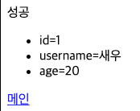

# 서블릿, JSP, MVC 패턴
## 회원 관리 웹 애플리케이션 요구사항
### 요구사항
* 회원 정보
  * 이름: username
  * 나이: age
* 기능 요구사항
  * 회원 저장
  * 회원 목록 조회

### 회원 도메인 모델
```java
@Getter @Setter
public class Member {
    private Long id;
    private String username;
    private int age;

    public Member() {}

    public Member(String username, int age) {
        this.username = username;
        this.age = age;
    }
}
```
* `id`는 `Member`를 회원 저장소에 저장하면 회원 저장소가 할당한다.

### 회원 저장소
```java
/**
 * 동시성 문제가 교려되어 있지 않음.
 * 실무에서는 ConcurrentHashMap, AtomicLong 사용 고려.
 * 
 * 싱글톤 패턴 사용.
 */
public class MemberRepository {
    private static Map<Long, Member> store = new HashMap<>();
    private static Long sequence = 0L;

    private static final MemberRepository instance = new MemberRepository();

    private MemberRepository() {}
    public static MemberRepository getInstance() {
        return instance;
    }

    public Member save(Member member) {
        member.setId(++sequence);
        store.put(member.getId(), member);
        return member;
    }

    public Member findById(Long id) {
        return store.get(id);
    }

    public List<Member> findAll() {
        return new ArrayList<>(store.values());
    }

    public void clearStore() {
        store.clear();
    }
}
```
회원 저장소는 싱글톤 패턴을 적용했다.
스프링을 사용하면 스프링 빈으로 등록하면 되지만, 지금은 최대한 스프링 없이 순수 서블릿 만으로 구현하는 것이 목적이다. <br>
싱글톤 패턴을 객체를 단 하나만 생성해서 공유해야 하므로 생성자를 `private` 접근자로 막아둔다.

### 회원 저장소 테스트 코드
```java
class MemberRepositoryTest {
    MemberRepository memberRepository = MemberRepository.getInstance();

    @AfterEach
    void afterEach() {
        memberRepository.clearStore();
    }

    @Test
    void save() {
        // given
        Member member = new Member("hello", 20);

        // when
        Member savedMember = memberRepository.save(member);

        // then
        Member findMember = memberRepository.findById(savedMember.getId());
        assertThat(findMember).isEqualTo(savedMember);
    }

    @Test
    void findAll() {
        // given
        Member m1 = new Member("member1", 20);
        Member m2 = new Member("member2", 30);

        memberRepository.save(m1);
        memberRepository.save(m2);

        // when
        List<Member> result = memberRepository.findAll();

        // then
        assertThat(result.size()).isEqualTo(2);
        assertThat(result).contains(m1, m2);
    }
}
```
회원을 저장하고, 목록을 조회하는 테스트를 작성했다.
각 테스트가 끝날 때, 다음 테스트에 영향을 주지 않도록 각 테스트의 저장소를 `clearStore()`를 호출해서 초기화했다.

## 서블릿으로 회원 관리 웹 애플리케이션 만들기
이제 본격적으로 서블릿으로 회원 관리 웹 애플리캐이션을 만들어보자.

가장 먼저 서블릿으로 회원 등록 HTML 폼을 제공해보자.

### MemberFormServlet - 회원 등록 폼
```java
@WebServlet(
        name = "memberFormServlet",
        urlPatterns = "/servlet/members/new-form"
)
public class MemberFormServlet extends HttpServlet {
    @Override
    protected void service(
            HttpServletRequest req,
            HttpServletResponse resp
    ) throws IOException {
        resp.setContentType("text/html");
        resp.setCharacterEncoding("utf-8");

        PrintWriter w = resp.getWriter();
        w.write("<!DOCTYPE html>\n" +
                "<html>\n" +
                "<head>\n" +
                " <meta charset=\"UTF-8\">\n" +
                " <title>Title</title>\n" +
                "</head>\n" +
                "<body>\n" +
                "<form action=\"/servlet/members/save\" method=\"post\">\n" +
                " username: <input type=\"text\" name=\"username\" />\n" +
                " age: <input type=\"text\" name=\"age\" />\n" +
                " <button type=\"submit\">전송</button>\n" +
                "</form>\n" +
                "</body>\n" +
                "</html>\n");
    }
}
```


### MemberSaveServlet - 회원 저장
```java
@WebServlet(
        name = "memberSaveServlet",
        urlPatterns = "/servlet/members/save"
)
public class MemberSaveServlet extends HttpServlet {
    private MemberRepository memberRepository = MemberRepository.getInstance();

    @Override
    protected void service(
            HttpServletRequest req,
            HttpServletResponse resp
    ) throws ServletException, IOException {
        System.out.println("MemberSaveServlet.service");
        String username = req.getParameter("username");
        int age = Integer.parseInt(req.getParameter("age"));

        Member member = new Member(username, age);
        System.out.println("member = " + member);
        memberRepository.save(member);

        resp.setContentType("text/html");
        resp.setCharacterEncoding("utf-8");

        PrintWriter w = resp.getWriter();
        w.write("<html>\n" +
                "<head>\n" +
                " <meta charset=\"UTF-8\">\n" +
                "</head>\n" +
                "<body>\n" +
                "성공\n" +
                "<ul>\n" +
                " <li>id="+member.getId()+"</li>\n" +
                " <li>username="+member.getUsername()+"</li>\n" +
                " <li>age="+member.getAge()+"</li>\n" +
                "</ul>\n" +
                "<a href=\"/index.html\">메인</a>\n" +
                "</body>\n" +
                "</html>");
    }
}
```
`MemberSaveServlet`은 다음 순서로 동작한다.
1. 파라미터를 조회해서 Member 객체를 만든다.
2. Member 객체를 MemberRepository를 통해서 저장한다.
3. Member 객체를 사용해서 결과 화면용 HTML을 동적으로 만들어서 응답한다.

### 실행 결과


### MemberListServlet - 회원 목록
```java
@WebServlet(
        name = "memberListServlet",
        urlPatterns = "/servlet/members"
)
public class MemberListServlet extends HttpServlet {
    MemberRepository memberRepository = MemberRepository.getInstance();

    @Override
    protected void service(
            HttpServletRequest req,
            HttpServletResponse resp
    ) throws ServletException, IOException {
        resp.setContentType("text/html");
        resp.setCharacterEncoding("utf-8");

        List<Member> members = memberRepository.findAll();

        PrintWriter w = resp.getWriter();
        w.write("<html>");
        w.write("<head>");
        w.write(" <meta charset=\"UTF-8\">");
        w.write(" <title>Title</title>");
        w.write("</head>");
        w.write("<body>");
        w.write("<a href=\"/index.html\">메인</a>");
        w.write("<table>");
        w.write(" <thead>");
        w.write(" <th>id</th>");
        w.write(" <th>username</th>");
        w.write(" <th>age</th>");
        w.write(" </thead>");
        w.write(" <tbody>");

        for (Member member : members) {
            w.write(" <tr>");
            w.write(" <td>" + member.getId() + "</td>");
            w.write(" <td>" + member.getUsername() + "</td>");
            w.write(" <td>" + member.getAge() + "</td>");
            w.write(" </tr>");
        }

        w.write(" </tbody>");
        w.write("</table>");
        w.write("</body>");
        w.write("</html>");
    }
}
```
`MemberListServlet`은 다음 순서로 동작한다.
* `memberRepository.findAll()`을 통해서 모든 회원을 조회한다.
* 회원 목록 HTML을 for 루프를 통해서 회원 수 만큼 동적으로 생성하고 응답한다.

### 템플릿 엔진으로
지금까지 서블릿과 자바 코드만으로 HTML을 만들어보앗다.
서블릿 덕분에 동적으로 원하는 HTML을 마음껏 만들 수 있다.
정적인 HTML 문서라면 화면이 계속 달라지는 회원의 저장 결과라던가, 회원 목록같은 동적인 HTML을 만드는 일은 불가능 할 것이다.

그런데, 코드에서 보듯이 이것은 매우 복잡하고 비효율적이다. 
자바 코드로 HTML을 만들어 내는 것보다 차라리 HTML 문서에 동적으로 변경해야 하는 부분만 자바 코드를 넣을 수 있다면 더 편리할 것이다.
이것이 바로 템플릿 엔진이 나온 이유이다.
템플릿 엔진을 사용하면 HTML문서에서 필요한 곳만 코드를 적용해서 변경할 수 있다.
템플릿 엔진에는 JSP, Thymeleaf, Freemarker, Velocity 등이 있다.
다음 시간에는 JSP로 동일한 작업을 진행해보자.

> 참고<br>
> JSP는 성능과 기능면에서 다른 템플릿 엔진과의 경쟁에서 밀리면서, 점점 사장되어 가는 추세이다.
> 템플릿 엔진들은 각각 장단점이 있는데, 강의에서는 JSP는 앞부분에서 잠깐 다루고,
> 스프링과 잘 통합되는 Thymeleaf를 사용한다.

### Welcome 페이지 변경
```html
<!DOCTYPE html>
<html>
<head>
  <meta charset="UTF-8">
  <title>Title</title>
</head>
<body>
<ul>
  <li><a href="basic.html">서블릿 basic</a></li>
  <li>서블릿
    <ul>
      <li><a href="/servlet/members/new-form">회원가입</a></li>
      <li><a href="/servlet/members">회원목록</a></li>
    </ul>
  </li>
  <li>JSP
    <ul>
      <li><a href="/jsp/members/new-form.jsp">회원가입</a></li>
      <li><a href="/jsp/members.jsp">회원목록</a></li>
    </ul>
  </li>
  <li>서블릿 MVC
    <ul>
      <li><a href="/servlet-mvc/members/new-form">회원가입</a></li>
      <li><a href="/servlet-mvc/members">회원목록</a></li>
    </ul>
  </li>
  <li>FrontController - v1
    <ul>
      <li><a href="/front-controller/v1/members/new-form">회원가입</a></li>
      <li><a href="/front-controller/v1/members">회원목록</a></li>
    </ul>
  </li>
  <li>FrontController - v2
    <ul>
      <li><a href="/front-controller/v2/members/new-form">회원가입</a></li>
      <li><a href="/front-controller/v2/members">회원목록</a></li>
    </ul>
  </li>
  <li>FrontController - v3
    <ul>
      <li><a href="/front-controller/v3/members/new-form">회원가입</a></li>
      <li><a href="/front-controller/v3/members">회원목록</a></li>
    </ul>
  </li>
  <li>FrontController - v4
    <ul>
      <li><a href="/front-controller/v4/members/new-form">회원가입</a></li>
      <li><a href="/front-controller/v4/members">회원목록</a></li>
    </ul>
  </li>
  <li>FrontController - v5 - v3
    <ul>
      <li><a href="/front-controller/v5/v3/members/new-form">회원가입</a></
      li>
      <li><a href="/front-controller/v5/v3/members">회원목록</a></li>
    </ul>
  </li>
  <li>FrontController - v5 - v4
    <ul>
      <li><a href="/front-controller/v5/v4/members/new-form">회원가입</a></
      li>
      <li><a href="/front-controller/v5/v4/members">회원목록</a></li>
    </ul>
  </li>
  <li>SpringMVC - v1
    <ul>
      <li><a href="/springmvc/v1/members/new-form">회원가입</a></li>
      <li><a href="/springmvc/v1/members">회원목록</a></li>
    </ul>
  </li>
  <li>SpringMVC - v2
    <ul>
      <li><a href="/springmvc/v2/members/new-form">회원가입</a></li>
      <li><a href="/springmvc/v2/members">회원목록</a></li>
    </ul>
  </li>
  <li>SpringMVC - v3
    <ul>
      <li><a href="/springmvc/v3/members/new-form">회원가입</a></li>
      <li><a href="/springmvc/v3/members">회원목록</a></li>
    </ul>
  </li>
</ul>
</body>
</html>
```

## JSP로 회원 관리 웹 애플리케이션 만들기

## MVC 패턴 - 개요

## MVC 패턴 - 적용

## MVC 패턴 - 한계
