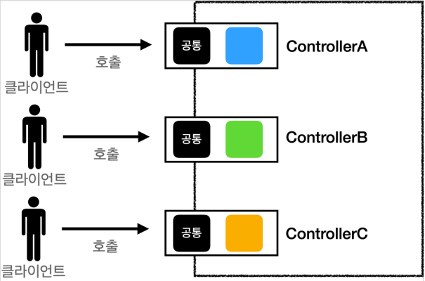
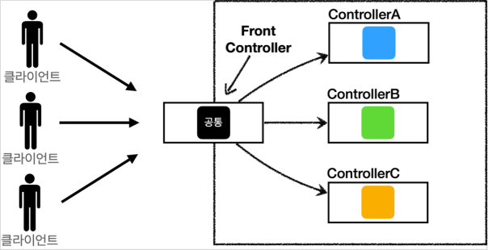
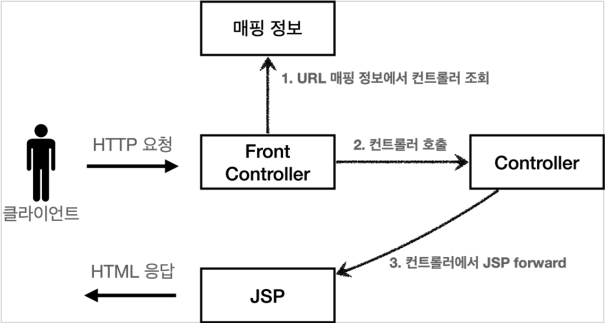
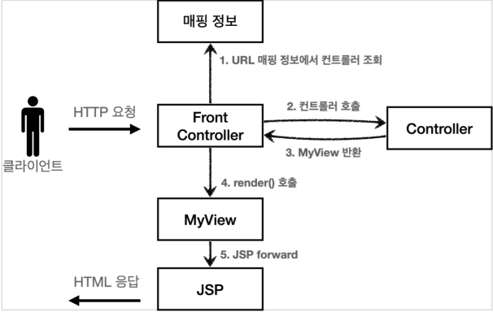
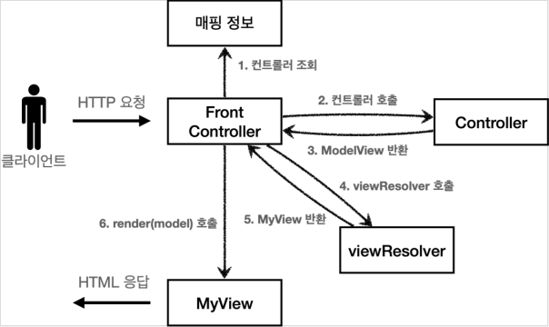
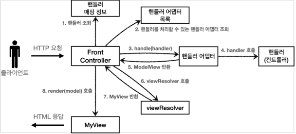

# MVC 프레임워크 만들기
## 프론트 컨트롤러 패턴 소개
### 프론트 컨트롤러 도입 전


### 프론트 컨트롤러 도입 후


### Front Controller 패턴 특징
* 프론트 컨트롤러 서블릿 하나로 클라이언트의 요청을 받음
* 프론트 컨트롤러가 요청에 맞는 컨트롤러를 찾아서 호출
* 입구를 하나로!
* 공통 처리 가능
* 프론트 컨트롤러를 제외한 나머지 컨트롤러는 서블릿을 사용하지 않아도 됨

### 스프링 웹 MVC와 프론트 컨트롤러
* **스프링 웹 MVC의 핵심**도 바로 FrontController
* 스프링 웹 MVC의 **DispatcherServlet**이 FrontContoller 패턴으로 구현되어 있음.

## 프론트 컨트롤러 도입 - v1
프론트 컨트롤러를 단계적으로 도입해보자.
이번 목표는 기존 코드를 최대한 유지하면서, 프론트 컨트롤러를 도입하는 것이다.
먼저 구조를 맞추어두고 점진적으로 리펙터링 해보자.

### V1 구조


### Controller V1
```java
public interface ControllerV1 {
    void process(
            HttpServletRequest req, 
            HttpServletResponse resp
    ) throws ServletException, IOException;
}
```
서블릿과 비슷한 모양의 컨트롤러 인터페이스를 도입한다.
각 컨트롤러들은 이 인터페이스를 구현하면 된다.
프론트 컨트롤러는 이 인터페이스를 호출해서 구현과 관계없이 로직의 일관성을 가져갈 수 있다.

이제 이 인터페이스를 구현한 컨트롤러를 만들어보자.
지금 단계에서는 기존 로직을 최대한 유지하는게 핵심이다.

### MemberFormController V1 - 회원 등록 컨트롤러
```java
/**
 * 회원 등록 컨트롤러 V1
 */
public class MemberFormControllerV1 implements ControllerV1 {
    @Override
    public void process(
            HttpServletRequest req,
            HttpServletResponse resp
    ) throws ServletException, IOException {
        String viewPath = "/WEB-INF/views/new-form.jsp";
        RequestDispatcher dispatcher = req.getRequestDispatcher(viewPath);
        dispatcher.forward(req, resp);
    }
}
```

### MemberSaveController V1 - 회원 저장 컨트롤러
```java
/**
 * 회원 저장 컨트롤러 V1
 */
public class MemberSaveControllerV1 implements ControllerV1 {
    private MemberRepository memberRepository = MemberRepository.getInstance();

    @Override
    public void process(
            HttpServletRequest req,
            HttpServletResponse resp
    ) throws ServletException, IOException {
        String username = req.getParameter("username");
        int age = Integer.parseInt(req.getParameter("age"));

        Member member = new Member(username, age);
        memberRepository.save(member);

        req.setAttribute("member", member);

        String viewPath = "/WEB-INF/views/save-result.jsp";
        RequestDispatcher dispatcher = req.getRequestDispatcher(viewPath);
        dispatcher.forward(req, resp);
    }
}
```

### MemberListController V1 - 회원 목록 컨트롤러
```java
/**
 * 회원 목록 컨트롤러 V1
 */
public class MemberListControllerV1 implements ControllerV1 {
    private MemberRepository memberRepository = MemberRepository.getInstance();

    @Override
    public void process(
            HttpServletRequest req,
            HttpServletResponse resp
    ) throws ServletException, IOException {
        List<Member> members = memberRepository.findAll();
        req.setAttribute("members", members);

        String viewPath = "/WEB-INF/views/members.jsp";
        RequestDispatcher dispatcher = req.getRequestDispatcher(viewPath);
        dispatcher.forward(req, resp);
    }
}
```

### FrontControllerServlet V1 - 프론트 컨트롤러
```java
@WebServlet(
        name = "frontControllerServletV1",
        urlPatterns = "/front-controller/v1/*"
)
public class FrontControllerServletV1 extends HttpServlet {
    private Map<String, ControllerV1> controllerMap = new HashMap<>();

    public FrontControllerServletV1() {
        controllerMap.put("/front-controller/v1/members/new-form", new MemberFormControllerV1());
        controllerMap.put("/front-controller/v1/members/save", new MemberSaveControllerV1());
        controllerMap.put("/front-controller/v1/members", new MemberListControllerV1());
    }

    @Override
    protected void service(
            HttpServletRequest req,
            HttpServletResponse resp
    ) throws ServletException, IOException {
        System.out.println("FrontControllerServletV1.service");
        String requestURI = req.getRequestURI();

        ControllerV1 cont = controllerMap.get(requestURI);
        if(cont == null) {
            resp.setStatus(HttpServletResponse.SC_NOT_FOUND);
            return ;
        }

        cont.process(req, resp);
    }
}
```

### 프론트 컨트롤러 분석
#### urlPatterns
* `urlPatterns = "/front-controller/v1/*"`
  * `/front-controller/v1`를 포함한 하위 모든 요청은 이 서블릿에서 받아들인다.

#### controllerMap
* key: 매핑 URL
* value: 호출될 컨트롤러

#### service()
먼저 `requestURI`를 조회해서 실제 호출할 컨트롤러를 `controllerMap`에서 찾는다.
만약 없다면 404(SC_NOT_FOUND) 상태 코드를 반환한다.
컨트롤러를 찾고 `controller.process(req, resp);`을 호출해서 해당 컨트롤러를 실행한다.

> 참고
> * `req.requestURI()`: URL을 String으로 반환한다.
> * `req.requestURL()`: URL을 StringBuffer로 반환한다.

#### JSP
JSP는 이전 MVC에서 사용했던 것을 그대로 사용한다.

### 참고

> 참고<br>
> 개발하다보면 실무에서도 아키텍쳐를 변경해야할 때가 있다.
> 이 때, **구조를 수정할 때는 구조만 건들여야 한다.**
> 
> 수정하다보면 구조말고도 디테일한 부분이 눈에 밟혀 수정하고 싶은 충동이 생기는데,
> 그때 한 번에 개선을 하게 되면 다른 사람이 처리하는데도 힘들고, 사람이 다 기억하기도 힘들다.
> 
> 그러니, 디테일한 것이 보여도 TODO 리스트에 적은 다음 넘어가고, 
> 큰 구조를 먼저 변경이 완료된 후, 테스트까지 완료되면 커밋하고 나서 디테일한 것을 변경하자.

## View 분리 - v2
모든 컨트롤러에서 뷰로 이동하는 부분에 중복이 있고, 깔끔하지 않다.
```
String viewPath = "/WEB-INF/views/new-form.jsp";
RequestDispatcher dispatcher = request.getRequestDispatcher(viewPath);
dispatcher.forward(request, response);
```
이 부분을 깔끔하게 분리하기 위해 별도로 뷰를 처리하는 객체를 만들자.

### V2 구조


### MyView
뷰 객체는 이후 다른 버전에서도 함께 사용하므로 패키지 위치를 `front-controller`에 두었다.
```java
public class MyView {
    private String viewPath;

    public MyView(String viewPath) {
        this.viewPath = viewPath;
    }

    public void render(
            HttpServletRequest req,
            HttpServletResponse resp
    ) throws ServletException, IOException {
        RequestDispatcher dispatcher = req.getRequestDispatcher(viewPath);
        dispatcher.forward(req, resp);
    }
}
```
이 코드만 봐서는 어떻게 활용하는지 아직 감이 안올 것이다.
다음 버전의 컨트롤러 인터페이스를 만들어보자.

컨트롤러가 뷰를 반환하는 특징이 있다.

### Controller V2
```java
public interface ControllerV2 {
    MyView process(
            HttpServletRequest req,
            HttpServletResponse resp
    ) throws ServletException, IOException;
}
```

### MemberFormController V2 - 회원 등록 폼
```java
public class MemberFormControllerV2 implements ControllerV2 {
    @Override
    public MyView process(
            HttpServletRequest req,
            HttpServletResponse resp
    ) throws ServletException, IOException {
        return new MyView("/WEB-INF/views/new-form.jsp");
    }
}
```
이제 각 컨트롤러는 복잡한 `dispatcher.forward()`를 직접 생성해서 호출하지 않아도 된다.
단순히 MyView 객체를 생성하고 거기에 뷰 이름만 넣고 반환하면 된다.

`ControllerV1`을 구현한 클래스와 `ControllerV2`를 구현한 클래스를 비교해보면, 
이 부분의 중복이 확실하게 제거된 것을 확인할 수 있다.

### MemberFormController V2 - 회원 저장
```java
public class MemberSaveControllerV2 implements ControllerV2 {
    private MemberRepository memberRepository = MemberRepository.getInstance();

    @Override
    public MyView process(
            HttpServletRequest req,
            HttpServletResponse resp
    ) throws ServletException, IOException {
        String username = req.getParameter("username");
        int age = Integer.parseInt(req.getParameter("age"));

        Member member = new Member(username, age);
        memberRepository.save(member);

        req.setAttribute("member", member);
        return new MyView("/WEB-INF/views/save-result.jsp");
    }
}
```

### MemberListController V2 - 회원 목록
```java
public class MemberListControllerV2 implements ControllerV2 {
    private MemberRepository memberRepository = MemberRepository.getInstance();

    @Override
    public MyView process(
            HttpServletRequest req,
            HttpServletResponse resp
    ) throws ServletException, IOException {
        List<Member> members = memberRepository.findAll();
        req.setAttribute("members", members);

        return new MyView("/WEB-INF/views/members.jsp");
    }
}
```

### 프론트 컨트롤러 V2
```java
@WebServlet(
        name = "frontControllerServletV2",
        urlPatterns = "/front-controller/v2/*"
)
public class FrontControllerServletV2 extends HttpServlet {
    private Map<String, ControllerV2> controllerMap = new HashMap<>();

    public FrontControllerServletV2() {
        controllerMap.put("/front-controller/v2/members/new-form", new MemberFormControllerV2());
        controllerMap.put("/front-controller/v2/members/save", new MemberSaveControllerV2());
        controllerMap.put("/front-controller/v2/members", new MemberListControllerV2());
    }

    @Override
    protected void service(
            HttpServletRequest req,
            HttpServletResponse resp
    ) throws ServletException, IOException {
        System.out.println("FrontControllerServletV2.service");
        String requestURI = req.getRequestURI();

        ControllerV2 controller = controllerMap.get(requestURI);
        if( controller == null ) {
            resp.setStatus(HttpServletResponse.SC_NOT_FOUND);
            return ;
        }

        MyView view = controller.process(req, resp);
        view.render(req, resp);
    }
}
```
`ControllerV2`의 반환 타입이 `MyView`이므로 프론트 컨트롤러는 컨트롤러의 호출 결과로 `MyView`를 반환 받는다.
그리고 `view.render()`를 호출하면 `forward` 로직을 수행해서 JSP가 실행된다.

프론트 컨트롤러의 도입으로 `MyView`객체의 `render()`를 호출하는 부분을 모두 일관되게 처리할 수 있다.
각각의 컨트롤러는 `MyView`객체를 생성만 해서 반환하면 된다.

## Model 추가 - v3
### 서블릿 종속성 제거
컨트롤러 입장에서 `HttpServletRequest`, `HttpServletResponse`가 꼭 필요할까?
요청 파라미터 정보는 자바의 Map으로 대신 넘기도록 하면 지금 구조에서는 컨트롤러가 서블릿 기술을 몰라도 동작할 수 있다.
그리고 request 객체를 Model로 사용하는 대신에 별도의 Model 객체를 만들어서 반환하면 된다.
우리가 구현하는 컨트롤러가 서블릿 기술을 전혀 사용하지 않도록 변경해보자.
이렇게 하면 구현 코드도 매우 단순해지고, 테스트 코드 작성이 쉽다.

### 뷰 이름 중복 제거
컨트롤러에서 지정하는 뷰 이름에 중복이 있는 것을 확인할 수 있다.
컨트롤러는 뷰의 논리 이름을 반환하고, 실제 물리 위치의 이름은 프론트 컨트롤러에서 처리하도록 단순화하자.
이렇게 해두면 향후 뷰의 폴더 위치가 함께 이동해도 프론트 컨트롤러만 고치면 된다.

### V3 구조


### ModelView
지금까지 컨트롤러에서 서블릿에 종속적인 HttpServletRequest를 사용했다.
그리고 Model의 `request.setAttribute()`를 통해 데이터를 저장하고 뷰에 전달햇다.
서블릿의 종속성을 제거하기 위해 Model을 직접 만들고, 추가로 View 이름까지 전달하는 객체를 만들어보자.

참고로 `ModelView`객체는 다른 버전에서도 사용하므로 패키지를 `frontcontroller`에 둔다.
```java
@Getter @Setter
public class ModelView {
    private String viewName;
    private Map<String, Object> model = new HashMap<>();

    public ModelView(String viewName) {
        this.viewName = viewName;
    }
}
```
뷰의 이름과 뷰를 렌더링할 때 필요한 model 객체를 가지고 있다.
model은 단순히 map으로 되어있으므로 컨트롤러에서 뷰에 필요한 데이터를 key, value로 넣어주면 된다.

### Controller V3
```java
public interface ControllerV3 {
    ModelView process(
            Map<String, String> paramMap
    );
}
```

### MemberFormController V3
```java
public class MemberFormControllerV3 implements ControllerV3 {
    @Override
    public ModelView process(
            Map<String, String> paramMap
    ) {
        return new ModelView("new-form");
    }
}
```

### MemberSaveController V3
```java
public class MemberSaveControllerV3 implements ControllerV3 {
    private MemberRepository memberRepository = MemberRepository.getInstance();

    @Override
    public ModelView process(
            Map<String, String> paramMap
    ) {
        String username = paramMap.get("username");
        int age = Integer.parseInt(paramMap.get("age"));

        Member member = new Member(username, age);
        memberRepository.save(member);

        ModelView mv = new ModelView("save-result");
        mv.getModel().put("member", member);
        return mv;
    }
}
```

### MemberListController V3
```java
public class MemberListControllerV3 implements ControllerV3 {
    private MemberRepository memberRepository = MemberRepository.getInstance();

    @Override
    public ModelView process(
            Map<String, String> paramMap
    ) {
        List<Member> members = memberRepository.findAll();
        ModelView mv = new ModelView("members");
        mv.getModel().put("members", members);
        return mv;
    }
}
```

### FrontControllerServlet V3
```java
public class FrontControllerServletV3 extends HttpServlet {
    private Map<String, ControllerV3> controllerMap = new HashMap<>();

    public FrontControllerServletV3() {
        controllerMap.put("/front-controller/v3/members/new-form", new MemberFormControllerV3());
        controllerMap.put("/front-controller/v3/members/save", new MemberSaveControllerV3());
        controllerMap.put("/front-controller/v3/members", new MemberListControllerV3());
    }

    @Override
    protected void service(
            HttpServletRequest req,
            HttpServletResponse resp
    ) throws ServletException, IOException {
        String requestURI = req.getRequestURI();

        ControllerV3 controller = controllerMap.get(requestURI);
        if(controller == null) {
            resp.setStatus(HttpServletResponse.SC_NOT_FOUND);
            return ;
        }

        Map<String, String> paramMap = createParamMap(req);
        ModelView mv = controller.process(paramMap);

        String viewName = mv.getViewName();
        MyView view = viewResolver(viewName);
        view.render(mv.getModel(), req, resp);
    }

    /**
     * HttpServletRequest에서 파라미터 정보를 꺼내서 Map으로 반환한다.
     * 그리고 해당 Map을 컨트롤러에 전달하면서 호출한다.
     */
    private Map<String, String> createParamMap(HttpServletRequest req) {
        Map<String, String> paramMap = new HashMap<>();
    
        req.getParameterNames().asIterator()
                .forEachRemaining(
                        paramName -> paramMap.put(paramName, req.getParameter(paramName))
                );
    
        return paramMap;
    }
  
    /**
     * 컨트롤러가 반환한 논리 뷰 이름을 실제 물리 뷰 경로로 변경한다.
     * 그리고 실제 물리 경로가 있는 MyView 객체를 반환한다.
     * @param viewName
     * @return "/WEB-INF/views/" + viewName + ".jsp"
     */
    private MyView viewResolver(String viewName) {
        return new MyView("/WEB-INF/views/" + viewName + ".jsp");
    }
}
```

### MyView
```java
public class MyView {
    private String viewPath;

    public MyView(String viewPath) {
        this.viewPath = viewPath;
    }

    /**
     * V2 용 Render
     */
    public void render(
            HttpServletRequest req,
            HttpServletResponse resp
    ) throws ServletException, IOException {
        RequestDispatcher dispatcher = req.getRequestDispatcher(viewPath);
        dispatcher.forward(req, resp);
    }

    /**
     * V3 용 Render
     */
    public void render(
            Map<String, Object> model,
            HttpServletRequest req,
            HttpServletResponse resp
    ) throws ServletException, IOException {
        modelToRequestAttribute(model, req);
        RequestDispatcher dispatcher = req.getRequestDispatcher(viewPath);
        dispatcher.forward(req, resp);
    }

    /**
     * 모델의 데이터를 꺼내서 req.setAttribute()로 담아둔다.
     */
    private void modelToRequestAttribute(
            Map<String, Object> model,
            HttpServletRequest req
    ) {
        // model.forEach(req::setAttribute);
        model.forEach((key, value) -> req.setAttribute(key, value));
    }
}
```

## 단순하고 실용적인 컨트롤러 - v4
앞서 만든 v3 컨트롤러는 서블릿 종속성을 제거하고 뷰 경로의 종복을 제거하는 등, 잘 설계된 컨트롤러다.
그런데, 실제 컨트롤러 인터페이스를 구현하는 개발자 입장에서 보면, 항상 ModeView 객체를 생성하고 반환해야 하는 부분이 조금은 번거롭다.
좋은 프레임워크는 아키텍쳐도 중요하지만, 그와 더불어 실제 개발하는 개발자가 단순하고 편리하게 사용할 수 있어야 한다. 소위 실용성이 있어야 한다.

이번에는 v3를 조금 변경해서 실제 구현하는 개발자들이 매우 편리하게 개발할 수 있는 v4 버전을 개발해보자.

### V4 구조


### Controller V4
```java
public interface ControllerV4 {
    /**
     * @param paramMap
     * @param model
     * @return viewName
     */
    String process(
            Map<String, String> paramMap,
            Map<String, Object> model
    );
}
```

### MemberFormController V4
```java
public class MemberFormControllerV4 implements ControllerV4 {
    @Override
    public String process(
            Map<String, String> paramMap,
            Map<String, Object> model
    ) {
        return "new-form";
    }
}
```

### MemberSaveController V4
```java
public class MemberSaveControllerV4 implements ControllerV4 {
    private MemberRepository memberRepository = MemberRepository.getInstance();

    @Override
    public String process(
            Map<String, String> paramMap,
            Map<String, Object> model
    ) {
        String username = paramMap.get("username");
        int age = Integer.parseInt(paramMap.get("age"));

        Member member = new Member(username, age);
        memberRepository.save(member);

        model.put("member", member);
        return "save-result";
    }
}
```

### MemberListController V4
```java
public class MemberListControllerV4 implements ControllerV4 {
    private MemberRepository memberRepository = MemberRepository.getInstance();
    
    @Override
    public String process(
            Map<String, String> paramMap, 
            Map<String, Object> model
    ) {
        List<Member> members = memberRepository.findAll();
        model.put("members", members);
        return "members";
    }
}
```

### FrontControllerServlet V4
```java
@WebServlet(
        name = "frontControllerServletV4",
        urlPatterns = "/front-controller/v4/*"
)
public class FrontControllerServletV4 extends HttpServlet {
    private Map<String, ControllerV4> controllerMap = new HashMap<>();

    public FrontControllerServletV4() {
        controllerMap.put("/front-controller/v4/members/new-form", new MemberFormControllerV4());
        controllerMap.put("/front-controller/v4/members/save", new MemberSaveControllerV4());
        controllerMap.put("/front-controller/v4/members", new MemberListControllerV4());
    }

    @Override
    protected void service(
            HttpServletRequest req,
            HttpServletResponse resp
    ) throws ServletException, IOException {
        System.out.println("FrontControllerServletV4.service");
        String requestURI = req.getRequestURI();

        ControllerV4 controller = controllerMap.get(requestURI);
        if( controller == null ) {
            resp.setStatus(HttpServletResponse.SC_NOT_FOUND);
            return ;
        }

        Map<String, String> paramMap = createParamMap(req);
        Map<String, Object> model = new HashMap<>();

        String viewName = controller.process(paramMap, model);

        MyView view = viewResolver(viewName);
        view.render(model, req, resp);
    }

    public Map<String, String> createParamMap(
            HttpServletRequest req
    ) {
        Map<String, String> paramMap = new HashMap<>();
        req.getParameterNames().asIterator()
                .forEachRemaining(paramName -> paramMap.put(paramName, req.getParameter(paramName)));
        return paramMap;
    }

    public MyView viewResolver(String viewName) {
        return new MyView("/WEB-INF/views/" + viewName + ".jsp");
    }
}
```

### 정리
이번 버전의 컨트롤러는 매우 단순하고 실용적이다.
기본 구조에서 모델을 파라미터로 넘기고, 뷰의 논리 이름을 반환한다는 작은 아이디어를 적용했을 뿐인데, 
컨트롤러를 구현하는 개발자 입장에서 보면 이제 군더더기 없는 코드를 작성할 수 있다.

또한 중요한 사실은 여기까지 한번에 온 것이 아니라는 점이다.
프레임워크가 점진적으로 발전하는 과정속에서 이런 방법도 찾을 수 있다.

**프레임워크나 공통 기능이 수고로워야 사용하는 개발자가 편리해진다.**

## 유연한 컨트롤러1 - v5
만약 어떤 개발자는 `ControllerV3`방식으로 개발하고 싶고, 
어떤 개발자는 `ControllerV4`방식으로 개발하고 싶다면 어떻게 해야할까?

### 어댑터 패턴
지금까지 우리가 개발한 프론트 컨트롤러는 한 가지 방식의 컨트롤러 인터페이스만 사용할 수 있다.
`ControllerV3`, `ControllerV4`는 완전히 다른 인터페이스이다. 따라서 호환이 불가능하다.
이럴때 사용하는 패턴이 바로 어댑터 패턴이다.
어댑터 패턴을 사용해서 프론트 컨트롤러가 다양한 방식의 컨트롤러를 처리할 수 있도록 변경해보자.

### V5 구조

* 핸들러 어댑터
  * 중간에 어댑터 역할을 하는 어댑터가 추가되었는데, 이름이 핸들러 어댑터 이다.
  * 여기서 어댑터 역할을 해주는 덕분에 다양한 종류의 컨트롤러를 호출할 수 있다.
* 핸들러
  * 컨트롤러의 이름을 더 넓은 범위인 핸들러로 변경했다.
  * 그 이유는 이제 어댑터가 있기 떄문에 꼭 컨트롤러의 개념 뿐만 아니라 어떠한 것이든 해당하는 종류의 어댑터만 있으면 다 처리할 수 있기 때문이다.

### MyHandlerAdapter
```java
public interface MyHandlerAdapter {
  /**
   * 어댑터가 해당 컨트롤러를 처리할 수 있는지 판단하는 메소드
   *
   * @param handler
   * @return 어댑터가 해당 컨트롤러를 처리할 수 있는지 여부
   */
  boolean supports(Object handler);

  /**
   * 어댑터는 실제 컨트롤러를 호출하고, 그 결과로 ModelView 를 반환한다.
   * 실제 컨트롤러가 ModelView를 반환하지 못하면, 어댑터가 ModelView를 직접 생성해서라도 반환해야 한다.
   * 이전에는 프론트 컨트롤러가 실제 컨트롤러를 호출했지만, 이제는 이 어댑터를 통해서 실제 컨트롤러가 호출된다.
   *
   * @return ModelView
   */
  ModelView handle(
          HttpServletRequest req,
          HttpServletResponse resp,
          Object handler
  ) throws ServletException, IOException;
}
```

### ControllerV3HandlerAdapter
```java
public class ControllerV3HandlerAdapter implements MyHandlerAdapter {
  /**
   * Controller V3를 처리할 수 있는 어댑터를 뜻한다.
   */
  @Override
  public boolean supports(Object handler) {
    return (handler instanceof ControllerV3);
  }

  /**
   * handler를 Controller V3로 변환한 다음에 V3 형식에 맞도록 호출한다.
   * supports()를 통해 ControllerV3 만 지원하기 때문에 타입 변환은 걱정없이 실행해도 된다.
   * ControllerV3는 ModelView를 반환하므로 그대로 ModelView를 반환하면 된다.
   */
  @Override
  public ModelView handle(
          HttpServletRequest req,
          HttpServletResponse resp,
          Object handler
  ) throws ServletException, IOException {
    ControllerV3 controller = (ControllerV3) handler;
    Map<String, String> paramMap = createParamMap(req);

    ModelView mv = controller.process(paramMap);
    return mv;
  }

  private Map<String, String> createParamMap(HttpServletRequest req) {
    Map<String, String> paramMap = new HashMap<>();
    req.getParameterNames().asIterator()
            .forEachRemaining(paramName -> paramMap.put(paramName, req.getParameter(paramName)));
    return paramMap;
  }
}
```

### FrontControllerServletV5
```java
@WebServlet(
        name = "frontControllerServletV5",
        urlPatterns = "/front-controller/v5/*"
)
public class FrontControllerServletV5 extends HttpServlet {
  /**
   * Controller -> Handler
   * 이전에는 컨트롤러를 직접 매핑해서 사용했다.
   * 그런데 이제는 어댑터를 사용하기 때문에, 컨트롤러 뿐만 아니라 어댑터가 지원하기만 하면, 어떤 것이라도 URL에 매핑해서 사용할 수 있다.
   * 그래서 이름을 컨트롤러에서 더 넓은 범위의 핸들러로 변경했다.
   */
  private final Map<String, Object> handlerMappingMap = new HashMap<>();
  private final List<MyHandlerAdapter> handlerAdapters = new ArrayList<>();

  public FrontControllerServletV5() {
    initHandlerMappingMap();
    initHandlerAdapter();
  }

  /**
   * Handler 매핑 초기화
   */
  private void initHandlerMappingMap() {
    handlerMappingMap.put("/front-controller/v5/v3/members/new-form", new MemberFormControllerV3());
    handlerMappingMap.put("/front-controller/v5/v3/members/save", new MemberSaveControllerV3());
    handlerMappingMap.put("/front-controller/v5/v3/members", new MemberListControllerV3());
  }

  /**
   * Adapter 초기화
   */
  private void initHandlerAdapter() {
    handlerAdapters.add(new ControllerV3HandlerAdapter());
  }

  @Override
  protected void service(
          HttpServletRequest req,
          HttpServletResponse resp
  ) throws ServletException, IOException {
    // Handler 매핑
    Object handler = getHandler(req);
    if (handler == null) {
      resp.setStatus(HttpServletResponse.SC_NOT_FOUND);
      return;
    }

    // Handler를 처리할 수 있는 어댑터 조회
    MyHandlerAdapter adapter = getHandlerAdapter(handler);
    /**
     * Adapter 호출
     * 어댑터의 handle() 메서드를 통해 실제 어댑터가 호출된다.
     * 어댑터는 handler를 호출하고 그 결과를 어댑터에 맞추어 반환한다.
     * ControllerV3HandlerAdapter의 경우 어댑터의 모양과 컨트롤러의 모양이 유사해서 변환 로직이 단순하다.
     */
    ModelView mv = adapter.handle(req, resp, handler);

    MyView view = viewResolver(mv.getViewName());
    view.render(mv.getModel(), req, resp);
  }

  /**
   * Handler 매핑
   * 핸들러 매핑 정보인 handlerMappingMap에서 URL에 매핑된 핸들러 객체를 찾아서 반환한다.
   */
  private Object getHandler(HttpServletRequest req) {
    String requestURI = req.getRequestURI();
    return handlerMappingMap.get(requestURI);
  }

  /**
   * Handler를 처리할 수 있는 어댑터 조회
   * 핸들러를 처리할 수 있는 어댑터를 adapter.supports(handler)를 통해서 찾는다.
   * 핸들러가 ControllerV3 인터페이스를 구현했다면, ControllerV3HandlerAdapter 객체가 반환된다.
   */
  private MyHandlerAdapter getHandlerAdapter(Object handler) {
    for (MyHandlerAdapter adapter : handlerAdapters) {
      if (adapter.supports(handler)) {
        return adapter;
      }
    }
    throw new IllegalArgumentException("handler adapter를 찾을 수 없습니다. handler = " + handler);
  }

  private MyView viewResolver(String viewName) {
    return new MyView("/WEB-INF/views/" + viewName + ".jsp");
  }
}
```

## 유연한 컨트롤러2 - v5
`FrontControllerServletV5`에 `ControllerV4` 기능도 추가해보자.
```java
public class FrontControllerServletV5 extends HttpServlet {
  /**
   * Handler 매핑 초기화
   */
  private void initHandlerMappingMap() {
    // V3 URL 매핑
    handlerMappingMap.put("/front-controller/v5/v3/members/new-form", new MemberFormControllerV3());
    handlerMappingMap.put("/front-controller/v5/v3/members/save", new MemberSaveControllerV3());
    handlerMappingMap.put("/front-controller/v5/v3/members", new MemberListControllerV3());

    // V4 URL 매핑
    handlerMappingMap.put("/front-controller/v5/v4/members/new-form", new MemberFormControllerV4());
    handlerMappingMap.put("/front-controller/v5/v4/members/save", new MemberSaveControllerV4());
    handlerMappingMap.put("/front-controller/v5/v4/members", new MemberListControllerV4());
  }

  /**
   * Adapter 초기화
   */
  private void initHandlerAdapter() {
    handlerAdapters.add(new ControllerV3HandlerAdapter());
    handlerAdapters.add(new ControllerV4HandlerAdapter());
  }
}
```

### ControllerV4HandlerAdapter
```java
public class ControllerV4HandlerAdapter implements MyHandlerAdapter {
  /**
   * handler가 ControllerV4 인 경우에만 처리하는 어댑터이다.
   */
  @Override
  public boolean supports(Object handler) {
    return (handler instanceof ControllerV4);
  }

  @Override
  public ModelView handle(
          HttpServletRequest req,
          HttpServletResponse resp,
          Object handler
  ) throws ServletException, IOException {
    // handler를 ControllerV4로 캐스팅
    ControllerV4 controller = (ControllerV4) handler;

    // paramMap, model 생성
    Map<String, String> paramMap = createParamMap(req);
    Map<String, Object> model = new HashMap<>();

    // 컨트롤러 호출, viewName 반환
    String viewName = controller.process(paramMap, model);

    /**
     * 어댑터 변환
     * 반환받은 viewName으로 ModelView를 생성해서 반환.
     */
    ModelView mv = new ModelView(viewName);
    mv.setModel(model);
    return mv;
  }

  private Map<String, String> createParamMap(HttpServletRequest req) {
    Map<String, String> paramMap = new HashMap<>();
    req.getParameterNames().asIterator()
            .forEachRemaining(paramName -> paramMap.put(paramName, req.getParameter(paramName)));
    return paramMap;
  }
}
```

## 정리
