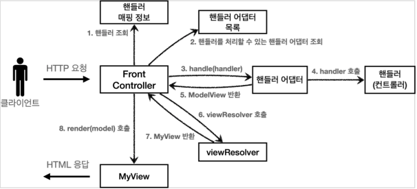
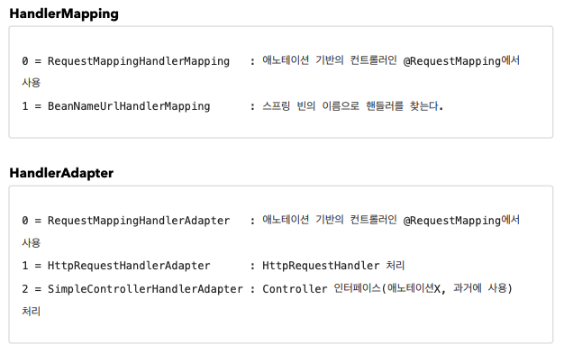

# 스프링 MVC - 구조 이해
## 스프링 MVC 전체 구조
직접 만든 MVC 프레임워크와 스프링 MVC를 비교해보자

### 직접 만든 MVC 프레임워크


### Spring MVC 구조


### 비교
* FrontController -> DispatcherServlet
* handlerMappingMap -> HandlerMapping
* MyHandlerAdapter -> HandlerAdapter
* ModelView -> ModelAndView
* viewResolver -> ViewResolver
* MyView -> View

### DispatcherServlet 구조 살펴보기
`org.springframework.web.servlet.DispatcherServlet`
* 스프링 MVC도 프론트 컨트롤러 패턴으로 구현되어 있다.
* 스프링 MVC의 프론트 컨트롤러가 바로 디스패처 서블릿(Dispatcher Servlet)이다.
* 이 디스패처 서블릿이 바로 스프링 MVC의 핵심이다.

### DispatcherServlet 서블릿 등록
* `DispatcherServlet`도 부모클래스에서 `HttpServlet`을 상속 받아서 사용하고, 서블릿으로 동작한다.
  * DispatcherServlet -> FrameworkServlet -> HttpServletBean -> HttpServlet
* 스프링 부트는 `DispatcherServlet`을 서블릿으로 자동으로 등록하면서 모든 경로(`urlPatterns="/"`)에 대해서 매핑한다.
  * 더 자세한 경로가 우선순위가 높다. 그래서 기존에 등록한 서블릿도 함께 동작한다.

### 요청 흐름
* 서블릿이 호출되면 `HttpServlet`이 제공하는 `service()`가 호출된다.
* 스프링 MVC는 `DispatcherServlet`의 부모인 `FrameworkServlet`에서 `service()`를 오버라이드 해두었다.
* `FrameworkdServlet.service()`를 시작으로 여러 메서드가 호출되면서 `DispatcherServlet.doDispatch()`가 호출된다.

### `DispatcherServlet.doDispatch()`
지금부터 `DispatcherServlet`의 핵심인 `doDispatch()` 코드를 분석해보자.
최대한 간단히 설명하기 위해 예외처리, 인터셉터 기능은 제외했다.
```java
class DispatcherServlet {
    protected void doDispatch(
            HttpServletRequest request, 
            HttpServletResponse response
    ) throws Exception {
        HttpServletRequest processedRequest = request;
        HandlerExecutionChain mappedHandler = null;
        ModelAndView mv = null;
        
        // 1. 핸들러 조회
        mappedHandler = getHandler(processedRequest);
        if (mappedHandler == null) {
            noHandlerFound(processedRequest, response);
            return;
        }
        
        // 2. 핸들러 어댑터 조회 - 핸들러를 처리할 수 있는 어댑터
        HandlerAdapter ha = getHandlerAdapter(mappedHandler.getHandler());
        
        // 3. 핸들러 어댑터 실행 -> 4. 핸들러 어댑터를 통해 핸들러 실행 -> 5. ModelAndView 반환
        mv = ha.handle(processedRequest, response, mappedHandler.getHandler());
        processDispatchResult(processedRequest, response, mappedHandler, mv, dispatchException);
    }

    private void processDispatchResult(
            HttpServletRequest request,
            HttpServletResponse response, 
            HandlerExecutionChain mappedHandler, 
            ModelAndView mv, 
            Exception exception
    ) throws Exception {
        // 뷰 렌더링 호출
        render(mv, request, response);
    }

    protected void render(
            ModelAndView mv, 
            HttpServletRequest request,
            HttpServletResponse response
    ) throws Exception {
        View view;
        String viewName = mv.getViewName();
        
        // 6. 뷰 리졸버를 통해서 뷰 찾기, 7. View 반환
        view = resolveViewName(viewName, mv.getModelInternal(), locale, request);
        
        // 8. 뷰 렌더링
        view.render(mv.getModelInternal(), request, response);
    }
}
```

### Spring MVC 구조

1. 핸들러 조회
   1. 핸들러 매핑을 통해 요청 URL에 매핑된 핸들러(컨트롤러)를 조회한다.
2. 핸들러 어댑터 조회
   1. 핸들러를 실행할 수 있는 핸들러 어댑터를 조회한다.
3. 핸들러 어댑터 실행
   1. 핸들러 어댑터를 실행한다.
4. 핸들러 실행
   1. 핸들러 어댑터가 실제 핸들러를 실행한다.
5. ModelAndView 반환
   1. 핸들러 어댑터는 핸들러가 반환하는 정보를 ModelAndView로 변환해서 반환한다.
6. viewResolver 호출
   1. 뷰 리졸버를 찾고 실행한다.
   2. JSP의 경우: `InternalResourceViewResolver`가 자동 등록되고, 사용된다.
7. View 반환
   1. 뷰 리졸버는 뷰의 논리 이름을 물리 이름으로 바꾸고, 렌더링 역할을 담당하는 뷰 객체를 반환한다.
   2. JSP의 경우: `InternalResourceView(JstlView)`를 반환하는데, 내부에 `forward()`로직이 있다.
8. 뷰 렌더링
   1. 뷰를 통해서 뷰를 렌더링 한다.

### 인터페이스 살펴보기
* 스프링 MVC의 큰 강점은 `DispatcherServlet` 코드의 변경 없이, 원하는 기능을 변경하거나 확장할 수 있다는 점이다. 
  지금까지 설명한 대부분을 확장 가능할 수 있게 인터페이스로 제공한다.
* 이 인터페이스들만 구현해서 `DispatcherServlet`에 등록하면 여러분만의 컨트롤러를 만들 수 있다.

### 주요 인터페이스 목록
* 핸들러 매핑: `HandlerMapping`
* 핸들러 어댑터: `HandlerAdapter`
* 뷰 리졸버: `ViewResolver`
* 뷰: `View`

### 정리
스프링 MVC는 코드 분량도 매우 많고, 복잡해서 내부 구조를 다 파악하는 것은 쉽지 않다. 
사실 해당 기능을 직접 확장하거나 나만의 컨트롤러를 만드는 일은 없으므로 걱정하지 않아도 된다.
왜냐하면 스프링 MVC는 전세계 수 많은 개발자들의 요구사항에 맞추어 기능을 계속 확장해왔고,
그래서 여러분이 웹 애플리케이션을 만들 때 필요로 하는 대부분의 기능이 이미 다 구현되어 있다.

그래도 이렇게 핵심 동작방식을 알아두어야 향후 문제가 발생했을 때 어떤 부분에서 문제가 발생했는지 쉽게 파악하고, 문제를 해결할 수 있다.
그리고 확장 포인트가 필요할 때, 어떤 부분을 확장해야 할지 감을 잡을 수 있다.
실제 다른 컴포넌트를 제공하거나 기능을 확장하는 부분들은 강의를 진행하면서 조금씩 설명하겠다.
지금은 전체적인 구조가 이렇게 되어 있구나 하고 이해하면 된다.

우리가 지금까지 함께 개발한 MVC 프레임워크와 유사한 구조여서 이해하기 어렵지 않았을 것이다.

## 핸들러 매핑과 핸들러 어댑터
핸들러 매핑과 핸들러 어댑터가 어떤 것들이 어떻게 사용되는지 알아보자.
지금은 전혀 사용하지 않지만, 과거에 주로 사용했던 스프링이 제공하는 간단한 컨트롤러로 핸들러 매핑과 어댑터를 이해해보자.

### Controller Interface
```java
public interface Controller {
    ModelAndView handleRequest(HttpServletRequest req, HttpServletResponse resp) throws Exception;
}
```
스프링도 처음에는 이런 딱딱한 형식의 컨트롤러를 제공했다.

> 참고<br>
> `Controller` 인터페이스는 `@Controller` 애노테이션과 전혀 다르다.

### OldController
```java
@Component("/springmvc/old-controller")
public class OldController implements Controller {
    @Override
    public ModelAndView handleRequest(
            HttpServletRequest request,
            HttpServletResponse response
    ) throws Exception {
        System.out.println("OldController.handleRequest");
        return null;
    }
}
```
* `@Component`: 이 컨트롤러는 `/springmvc/old-controller`라는 이름의 스프링 빈으로 등록되었다.
* 빈의 이름으로 URL을 매핑할 것이다.

### 이 컨트롤러는 어떻게 호출될 수 있었을까?
이 컨트롤러가 호출되려면 다음 2가지가 필요하다.
* HandlerMapping
  * 핸들러 매핑에서 이 컨트롤러를 찾을 수 있어야 한다.
  * 스프링 빈의 이름으로 핸들러를 찾을 수 있는 핸들러 매핑이 필요하다.
* HandlerAdapter
  * 핸들러 매핑을 통해서 찾은 핸들러를 실행할 수 있는 핸들러 어댑터가 필요하다.
  * `Controller` 인터페이스를 실행할 수 있는 핸들러 어댑터를 찾고 실행해야 한다.

### 스프링 부트가 자동 등록하는 핸들러 매핑과 핸들러 어댑터

핸들러 매핑도, 핸들러 어댑터도 모두 순서대로 찾고 만약 없으면 다음 순서로 넘어간다.

### HttpRequestHandler
핸들러 매핑과, 어댑터를 더 잘 이해하기 위해 Controller 인터페이스가 아닌 다른 핸들러를 알아보자.
`HttpRequestHandler` 핸들러는 서블릿과 가장 유사한 형태의 핸들러이다.
```java
public interface HttpRequestHandler {
	void handleRequest(HttpServletRequest request, HttpServletResponse response)
			throws ServletException, IOException;
}
```

### MyHttpRequestHandler
```java
@Component("/springmvc/request-handler")
public class MyHttpRequestHandler implements HttpRequestHandler {
    @Override
    public void handleRequest(
            HttpServletRequest request,
            HttpServletResponse response
    ) throws ServletException, IOException {
        System.out.println("MyHttpRequestHandler.handleRequest");
    }
}
```

### `@RequestMapping`
가장 많이 사용하는 컨트롤러

## 뷰 리졸버
이번에는 뷰 리졸버에 대해 자세히 알아보자.

### OldController - View 조회할 수 있도록 변경
```java
@Component("/springmvc/old-controller")
public class OldController implements Controller {
    @Override
    public ModelAndView handleRequest(
            HttpServletRequest request,
            HttpServletResponse response
    ) throws Exception {
        System.out.println("OldController.handleRequest");
        return new ModelAndView("new-form");
    }
}
```

실행해보면 컨트롤러를 정상 호출하지만, 오류 페이지가 나온다.

`application.properties`에 다음 코드를 추가하자.
```properties
spring.mvc.view.prefix=/WEB-INF/views/
spring.mvc.view.suffix=.jsp
```

### 뷰 리졸버 - InternalResourceViewResolver
스프링 부트는 `InternalResourceViewResolver`라는 뷰 리졸버를 자동으로 등록하는데, 
이때 `application.properties`에 등록한 `spring.mvc.view.prefix`, `spring.mvc.view.suffix` 설정 정보를 사용해서 등록한다.

> **참고**<br>
> `InternalResourceResolver`는 만약 JSTL 라이브러리가 있다면 `InternalResourceView`를 상속받은 `JstlView`를 반환한다.
> `JstlView`는 JSTL 태그 사용시 약간의 부가 기능이 추가된다.

> **참고**<br>
> 다른 뷰는 실제 뷰를 렌더링하지만, JSP의 경우 `forward()`통해서 해당 JSP로 이동해야 렌더링이 된다.
> JSP를 제외한 나머지 뷰 템플릿들은 `forward()`과정 없이 바로 렌더링된다.

> **참고**<br>
> Thymeleaf 뷰 템플릿을 사용하면 `ThymeleafViewResolver`를 등록해야 한다.
> 최근에는 라이브러리만 추가하면 스프링 부트가 이런 작업도 모두 자동화해준다.

## 스프링 MVC - 시작하기
스프링이 제공하는 컨트롤러는 애노테이션 기반으로 동작해서, 매우 유연하고 실용적이다.
과거에는 자바 언어에 애노테이션이 없기도 했고, 스프링도 처음부터 이런 유연한 컨트롤러를 제공한 것은 아니다.

### `@RequestMapping`
* 스프링은 애노테이션을 활용한 매우 유연하고, 실용적인 컨트롤러를 만들었는데 이것이 바로 `@RequestMapping` 애노테이션을 사용하는 컨트롤러이다.
* 핸들러 매핑과 핸들러 어댑터의 가장 높은 우선순위가 `@RequestMapping`이다.

### SpringMemberFormController V1
```java
@Controller
public class SpringMemberFormControllerV1 {
    @RequestMapping("/springmvc/v1/members/new-form")
    public ModelAndView process() {
        return new ModelAndView("new-form");
    }
}
```
* `@Controller`
  * 스프링이 자동으로 스프링 빈으로 등록된다.
  * 스프링 MVC에서 애노테이션 기반 컨트롤러로 인식한다.
* `@RequestMapping`
  * 요청 정보를 매핑한다.
  * 해당 URL이 호출되면 이 메서드가 호출된다.
  * 애노테이션 기반으로 동작하기 때문에, 메서드의 이름은 임의로 지으면 된다.
* `ModelAndView`
  * 모델과 뷰 정보를 담아서 반환하면 된다.

### SpringMemberSaveController V1
```java
@Controller
public class SpringMemberSaveControllerV1 {
    private MemberRepository memberRepository = MemberRepository.getInstance();

    @RequestMapping("/springmvc/v1/members/save")
    public ModelAndView process(
            HttpServletRequest req,
            HttpServletResponse resp
    ) {
        String username = req.getParameter("username");
        int age = Integer.parseInt(req.getParameter("age"));

        Member member = new Member(username, age);
        memberRepository.save(member);

        ModelAndView mv = new ModelAndView("save-result");
        mv.addObject("member", member);
        return mv;
    }
}
```

### SpringMemberListController V1
```java
@Controller
public class SpringMemberListControllerV1 {
    private MemberRepository memberRepository = MemberRepository.getInstance();

    @RequestMapping("/springmvc/v1/members")
    public ModelAndView process() {
        List<Member> members = memberRepository.findAll();

        ModelAndView mv = new ModelAndView("members");
        mv.addObject("members", members);
        return mv;
    }
}
```

## 스프링 MVC - 컨트롤러 통합
### SpringMemberController V2
```java
@Controller
@RequestMapping("/springmvc/v2/members")
public class SpringMemberControllerV2 {
    private MemberRepository memberRepository = MemberRepository.getInstance();

    @RequestMapping("/new-form")
    public ModelAndView newForm() {
        return new ModelAndView("new-form");
    }

    @RequestMapping("/save")
    public ModelAndView save(
            HttpServletRequest req,
            HttpServletResponse resp
    ) {
        String username = req.getParameter("username");
        int age = Integer.parseInt(req.getParameter("age"));

        Member member = new Member(username, age);
        memberRepository.save(member);

        ModelAndView mv = new ModelAndView("save-result");
        mv.addObject("member", member);
        return mv;
    }

    @RequestMapping
    public ModelAndView members() {
        List<Member> members = memberRepository.findAll();

        ModelAndView mv = new ModelAndView("members");
        mv.addObject("members", members);
        return mv;
    }
}
```

## 스프링 MVC - 실용적인 방식
